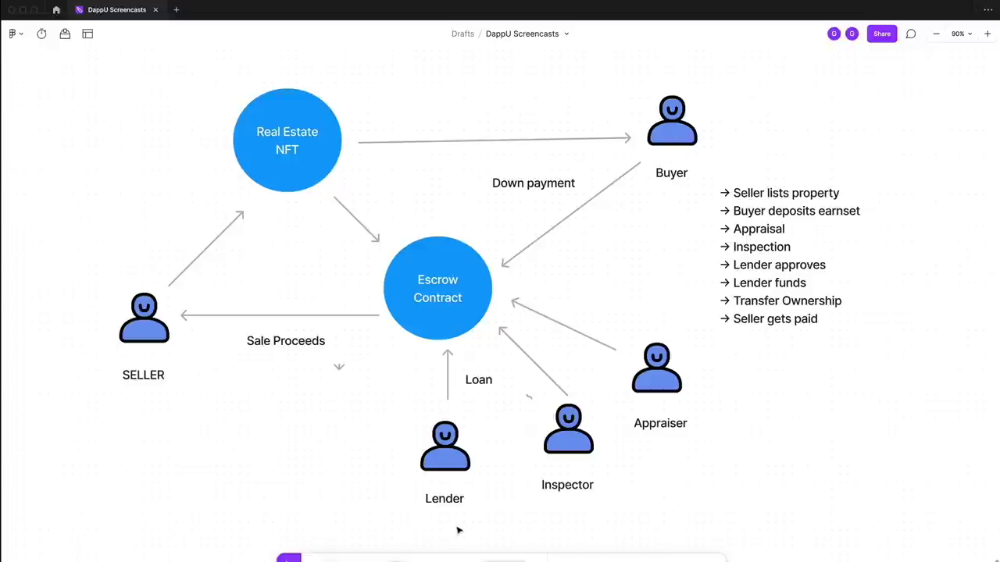

# Learn NFTs with Hardhat

## IPFS ERC-721

### Here's an example of some JSON metadata for an NFT:

```json
{
  "name": "No time to explain!",
  "description": "I said there was no time to explain, and I stand by that.",
  "image": "ipfs://bafybeict2kq6gt4ikgulypt7h7nwj4hmfi2kevrqvnx2osibfulyy5x3hu/no-time-to-explain.jpeg"
}
```



## Hardhat

## OpenZeppelin

## `using` keyword
## MINT Function
